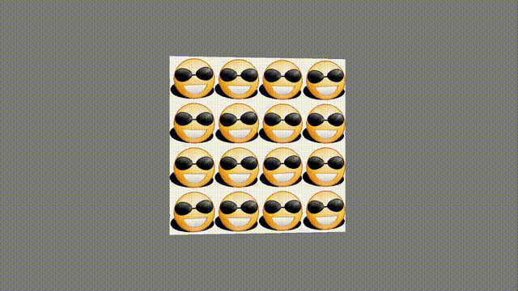

# RotateGLFW

**RotateGLFW** is an OpenGL-based Python program that uses GLFW to create a window and render a rotating 3D scene. This project demonstrates basic OpenGL techniques like shader management, buffer management, and texture rendering.

## Features

- Custom shaders (vertex and fragment)
- Animated 3D scene with texture mapping
- Keyboard input handling
- Simple window management using GLFW

## Requirements

To run this project, you need the following:

- Python 3.x
- Virtual environment (`venv`)
- Required Python packages listed in `requirements.txt`

## Installation

1. Clone this repository:
   ```bash
   git clone https://github.com/nmukh/rotateglfw.git
   cd rotateglfw
2. Set up the virtual environment and activate it:
    ```bash
   python3 -m venv venv
   source venv/bin/activate  # On Windows, use venv\Scripts\activate
3. Install the required dependencies:
    ```bash
    pip install -r requirements.txt

## Running the program

- To run the program
    ```bash
    python rotateglfw.py -n [number of repetitions]
    

- Watch the mild mannered 2D emoji 
turn into 


- Replace emoji.png with any other image of your fancy.

## Files in the Repository

- `rotateglfw.py`: Main program file.
- `utils.py`: Utility functions for loading shaders and textures.
- `vertex_shader.glsl`: Vertex shader source code.
- `fragment_shader.glsl`: Fragment shader source code.
- `emoji.png`: Texture used for rendering.
- `requirements.txt`: Python package requirements.
- `output.gif`: Example output animation.
- `venv/`: Virtual environment folder (not included in the repository).

## Controls

- **ESC**: Close the program.
- **Other Keys**: Placeholder for additional controls.

## License

This project is licensed under the MIT License. See the [LICENSE](LICENSE) file for details.


